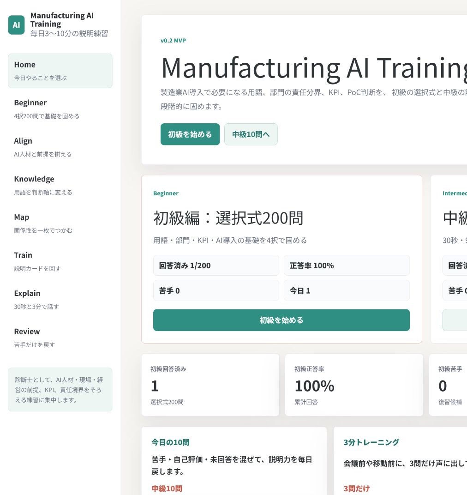
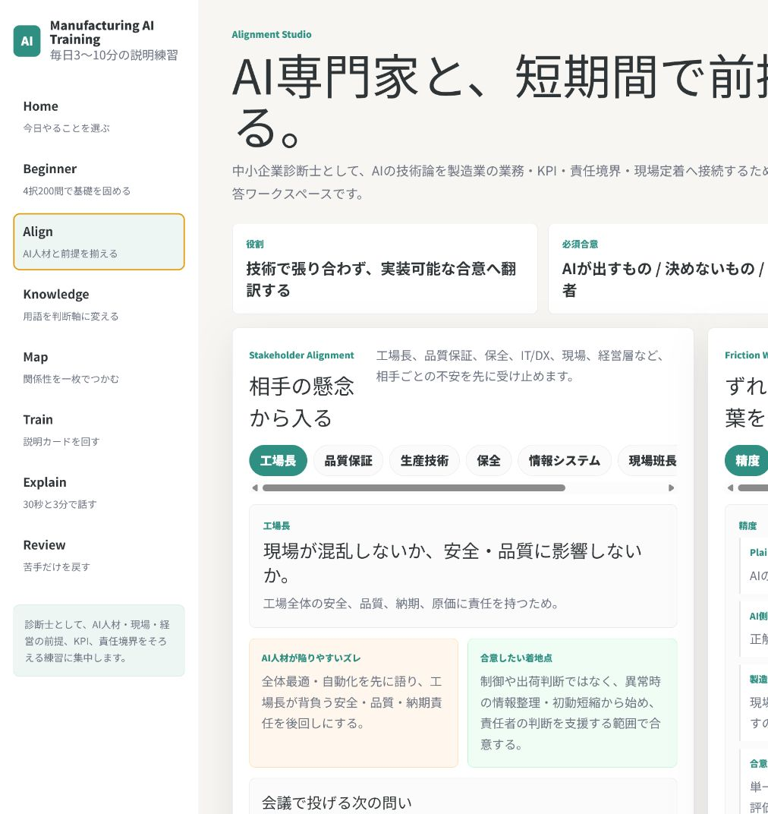
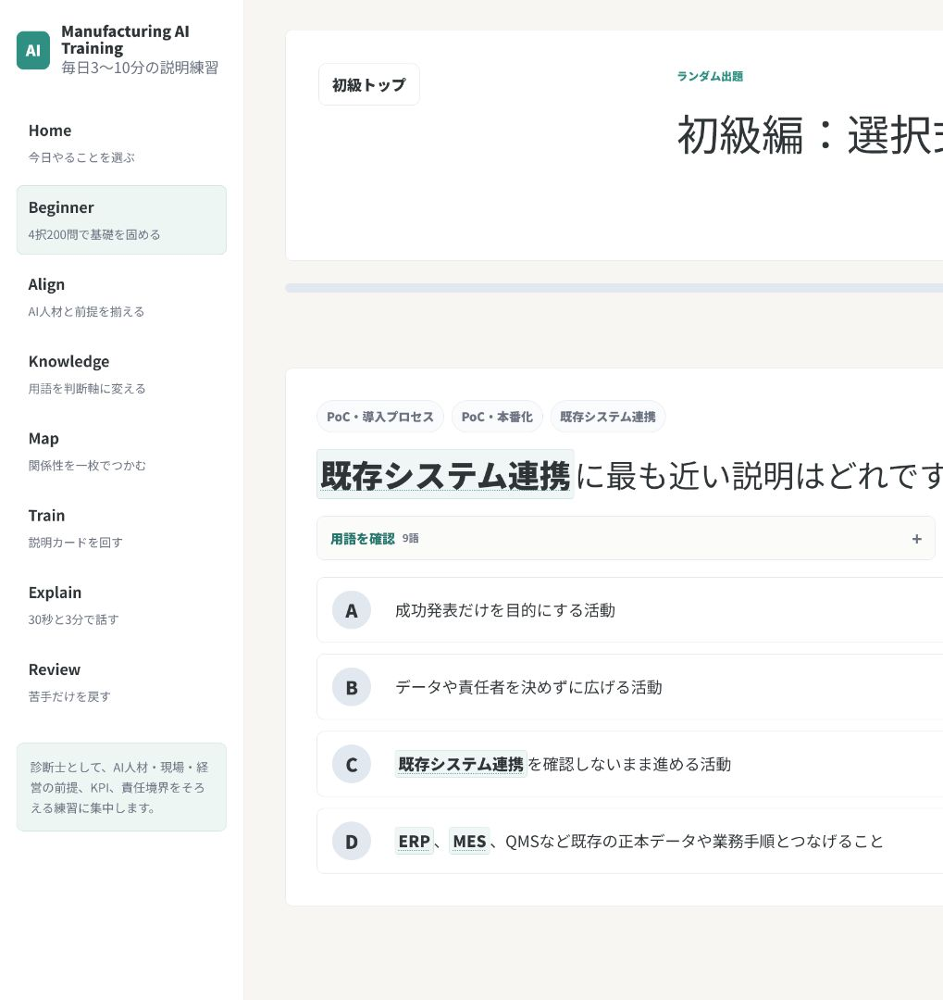
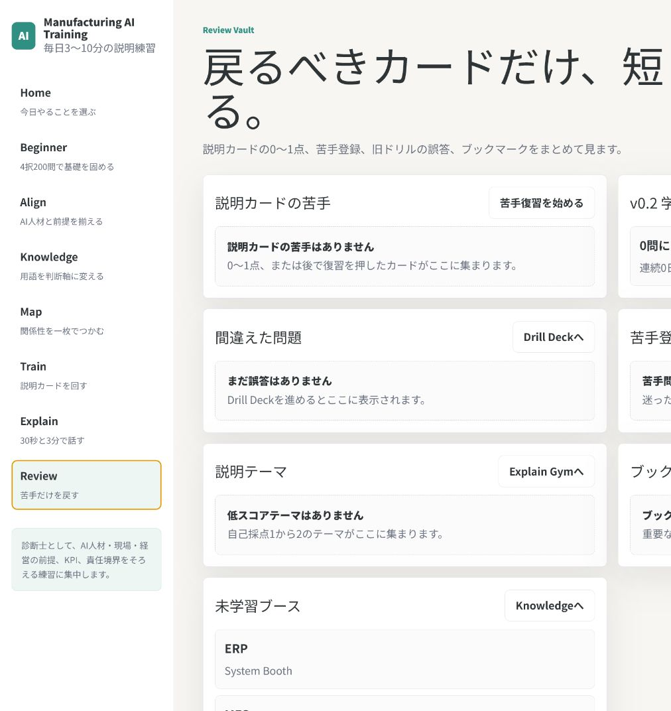

# Manufacturing AI Cockpit

> 製造業AI導入の「技術は分かるが、現場・品質・経営との合意形成が難しい」を、短時間の学習・説明練習・責任境界整理で支援するポートフォリオアプリです。

**Status:** portfolio-ready local source / static frontend demo  
**Live demo:** <https://manufacturing-ai-cockpit.netlify.app/>  
**Note:** 現行ローカルソースはGit管理外のcanonical実体です。公開前にサニタイズ済み新規リポジトリへallowlist方式で移す想定です。

## Executive summary / 概要

Manufacturing AI Cockpit is a React + TypeScript learning cockpit for consultants and business-side AI leads who need to explain manufacturing AI initiatives without overpromising automation. It turns manufacturing systems, KPIs, stakeholder concerns, and human approval boundaries into guided drills and review flows.

中小企業診断士・DX推進者・AI導入支援者が、製造業AIの提案時に起きやすい「AI人材・現場・品質保証・保全・IT/DX・経営層の認識ずれ」を防ぎ、短時間で安全に説明・合意形成できる状態を作るための学習アプリです。

## Why I built this

製造業AIの現場では、モデル精度や自動化の話だけではPoC後に止まりやすく、次の論点が残ります。

- ERP / MES / QMS / SCADA / PLC などのシステム粒度が揃っていない
- 品質・安全・出荷・ライン停止の責任境界をAIに寄せすぎる
- 工場長、品質保証、生産技術、保全、IT/DX、経営層で見ているKPIが違う
- 「精度」「リアルタイム」「自動化」などの言葉の意味が部門ごとにずれる

このアプリは、AI導入を「AIが最終判断する」話にせず、**判断材料の整理・説明練習・人間承認ゲート設計**に戻すために作っています。

## Target users

- 製造業AI・DX案件に関わる中小企業診断士、コンサルタント、事業開発担当
- AIエンジニアと製造現場の間をつなぐプロダクト/PM/プリセールス担当
- 製造業ドメイン理解を短時間で増やしたい学習者

## What it demonstrates

このポートフォリオで見せたい実装・設計力は次の通りです。

- React / TypeScript / Vite による複数画面アプリケーション構成
- 静的ドメインデータ、型定義、監査スクリプトによるコンテンツ品質管理
- `localStorage` を使った端末内進捗保存と保存失敗時のUI通知
- レスポンシブUI、カード型ナビゲーション、学習導線設計
- AI機能を任意・開発時限定にし、APIキーをフロントへ出さない分離設計
- 製造業AIにおける安全・品質・責任境界の明示

## Main features

| Area | Purpose | Recruiter-facing highlight |
|---|---|---|
| Cockpit | 学習導線と進捗の入口 | 複数モジュールを1つの体験へ統合 |
| Alignment Studio | ステークホルダー別の懸念・合意形成Canvas | 現場/品質/経営の認識ずれを構造化 |
| Beginner Choice | 初級200問の4択演習 | 大量の静的問題データと監査スクリプト |
| Drill Deck | 中級説明問題・回答記録 | 回答、苦手、用語参照、任意AI講評の状態管理 |
| Explain Gym | 30秒・3分説明練習 | コンサルティングで必要な説明力への変換 |
| Knowledge Booth | 用語・KPI・部門カード | 製造業システム/業務語彙の整理 |
| Map Room | ERP/MES/MOM/PLM/QMS/SCADA/PLC/OTの関係 | ドメイン構造の可視化 |
| Review Vault | 誤答・苦手・ブックマーク復習 | 学習履歴を使った復習導線 |

## Screenshots to capture

公開前に `docs/screenshots/` へ以下を配置する想定です。

1. `01-cockpit.png` — 全体導線、進捗、主要モジュール
2. `02-alignment-studio.png` — ステークホルダー別懸念と合意形成Canvas
3. `03-answer-confirmation.png` — Drill Deck / Beginner Choice の回答・解説・責任境界
4. `04-review-vault.png` — 誤答、苦手、ブックマーク、復習導線

詳細な撮影手順は [`docs/screenshots/README.md`](docs/screenshots/README.md) を参照してください。

| Cockpit | Alignment Studio |
|---|---|
|  |  |

| Answer confirmation | Review Vault |
|---|---|
|  |  |

## Architecture

```text
User
  -> React pages
      -> typed domain data in src/data
      -> progress hooks
          -> browser localStorage
      -> glossary matcher / labels / UI components
  -> optional development-only FUGU review client
      -> local Express server
          -> external model API configured by server-side env vars
```

- Static frontend is the default and public-safe path.
- FUGU review is development-only and hidden unless `import.meta.env.DEV` and `VITE_FUGU_ENABLED=true`.
- API keys are read only by the local Express server from environment variables.

More details: [`docs/architecture.md`](docs/architecture.md), [`docs/data-flow.md`](docs/data-flow.md), [`docs/human-approval-gates.md`](docs/human-approval-gates.md).

## Data representation

All app content is **synthetic demo/learning data**. It is not copied from any client project and does not represent a real factory, real customer, or confidential engagement.

Main data files:

- `src/data/concepts.ts` — manufacturing systems, departments, KPIs, AI touchpoints
- `src/data/beginnerChoiceQuestions.ts` — 200 beginner multiple-choice questions
- `src/data/trainingQuestions.ts` — 85 intermediate explanation questions
- `src/data/explainDrills.ts` — 30-second / 3-minute explanation drills
- `src/data/scenarios.ts` — stakeholder concerns and better/worse responses
- `src/data/glossary.ts` — inline glossary definitions and manufacturing context
- `src/data/glossaryFrictions.ts` — words whose meanings often drift between AI and manufacturing teams
- `src/data/decisionAuthority.ts` — what AI may support vs. what humans must decide
- `src/data/expertDialogues.ts` — better questions to ask AI/technical experts

## Human approval stance

The app repeatedly separates **AI support** from **human decision authority**.

AI may help with:

- searching past cases and similar issues
- summarizing inspection, maintenance, or production-plan context
- suggesting likely causes and next checks
- drafting explanations or confirmation checklists

Humans remain responsible for:

- safety decisions
- quality assurance and shipment decisions
- line stop / restart decisions
- PLC / DCS / equipment control changes
- production plan changes that affect customers, workers, or cost

## Setup

```bash
npm install
npm run dev
```

Open the local URL shown by Vite.

## Quality checks

```bash
npm run lint
npm run typecheck
npm run audit:questions
npm run audit:beginner
npm run audit:glossary
npm run build
```

`npm test` is mapped to the three data-audit scripts so that a reviewer can run one command for the core content checks.

## Optional local FUGU review server

FUGU review is an optional development helper. It is not required for the public static demo.

`.env.local` example:

```bash
VITE_FUGU_ENABLED=true
VITE_FUGU_REVIEW_ENDPOINT=/api/fugu-review
FUGU_API_KEY=replace-with-local-secret
FUGU_API_BASE=https://example.invalid/v1/chat/completions
FUGU_MODEL=replace-with-model-name
```

Run in separate terminals:

```bash
npm run fugu:server
npm run dev
```

Security notes:

- Keep `VITE_FUGU_ENABLED=false` for public builds.
- Do not commit `.env.local` or real API keys.
- The React app sends only question metadata and the answer text required for review; free-form private notes are not sent.
- If the server is not configured or times out, the training flow continues without FUGU review.

## Publication readiness

Before public release:

1. Copy only the allowlisted source files into a new sanitized public repository.
2. Exclude local operation files such as `AGENTS.md`, `audit/`, `reports/`, `.playwright-cli/`, `preview-*.log`, `node_modules/`, and existing `dist/`.
3. Run secret/PII scans against the final public copy.
4. Capture screenshots and verify all README image links.
5. Run lint, typecheck, test/audit, and build in the final public copy.
6. Confirm that the included MIT License remains appropriate for the final public release.

See [`docs/publication-readiness.md`](docs/publication-readiness.md).

## Limitations

- This is a learning and portfolio application, not a production MES/QMS/SCADA integration.
- It does not connect to real factory systems, customer data, or production equipment.
- Progress is stored only in the current browser via `localStorage`.
- The live Netlify URL is a static demo; source-to-deploy commit matching is not verified because the current canonical source is not a Git repository.
- The public candidate uses the MIT License.

## License

MIT. See [`LICENSE`](LICENSE).
