# Manufacturing AI Cockpit

A decision-support learning cockpit for manufacturing AI: it surfaces where the shop
floor, quality assurance, IT/DX, and management disagree, and makes explicit which
approvals must stay with people.

**Live demo:** <https://manufacturing-ai-cockpit.netlify.app/> ·
**Languages:** 日本語 / English · **Stack:** React 19 · TypeScript · Vite 7 · Tailwind 4

> **Note on the live demo.** The deployment predates this branch, and whether it was
> built from the current `main` has not been verified — see
> [Deployment status](#deployment-status). Treat the source in this repository as the
> reference, not the deployed page.

---

## English summary

Manufacturing AI projects rarely stall on model accuracy. They stall because ERP, MES,
QMS, and SCADA sit at different levels of granularity; because too much responsibility
for safety, quality, shipment release, and line stop drifts toward the AI; and because
the plant manager, quality assurance, production engineering, maintenance, IT/DX, and
management are each watching a different KPI.

This app turns that problem into practice. It presents manufacturing systems, KPIs,
stakeholder concerns, and human approval gates as guided drills, an alignment canvas,
and a review loop — so a consultant or business-side AI lead can explain an initiative
without overpromising automation.

It is a learning and portfolio application. It does not connect to real factory systems.

## 日本語概要

製造業AIの現場では、モデル精度の話だけではPoC後に止まりやすく、次の論点が残ります。

- ERP / MES / QMS / SCADA / PLC などのシステム粒度が揃っていない
- 品質・安全・出荷・ライン停止の責任境界をAIに寄せすぎる
- 工場長、品質保証、生産技術、保全、IT/DX、経営層で見ているKPIが違う
- 「精度」「リアルタイム」「自動化」などの言葉の意味が部門ごとにずれる

このアプリは、AI導入を「AIが最終判断する」話にせず、**判断材料の整理・説明練習・人間承認
ゲート設計**に戻すための学習コックピットです。中小企業診断士・DX推進者・AI導入支援者が、
短時間で安全に説明・合意形成できる状態を作ることを狙っています。

## Language switching

One codebase, two locale dictionaries — not two apps.

- Switch with the **日本語 / English** control in the sidebar. It is a WAI-ARIA radio
  group: one Tab stop, arrow keys to move, Enter or Space to select.
- The choice is remembered in `localStorage` and applies on the next visit.
- Link directly to a language with `?lang=ja` or `?lang=en`.
- Resolution order: **`?lang=` → stored choice → browser language → Japanese.**
- An explicit `?lang=` is authoritative even when its value is unsupported: `?lang=fr`
  opens in **Japanese** rather than falling through to the stored choice or the browser
  language. The URL is a deliberate instruction, so serving English because the browser
  happens to be `en-US` would ignore it. An *absent* parameter is not an instruction, so
  it does defer to the stored choice and then to the browser.
- `<html lang>`, `document.title`, and the meta description all follow the active locale.

| URL | Stored | Browser | Result |
|---|---|---|---|
| `?lang=fr` | `en` | `en-US` | **ja** |
| `?lang=invalid` | — | `en-US` | **ja** |
| none | `en` | `ja-JP` | **en** |
| none | — | `en-US` | **en** |
| none | — | `fr-FR` | **ja** |

Try it: [`?lang=en`](https://manufacturing-ai-cockpit.netlify.app/?lang=en) ·
[`?lang=ja`](https://manufacturing-ai-cockpit.netlify.app/?lang=ja) — subject to the
deployment caveat above.

### Translation coverage

| Layer | Coverage |
|---|---|
| UI chrome — navigation, all eight screens, errors, `aria-label`s | 541 string keys + 34 formatters, **100%** |
| Concepts (39), stakeholder scenarios (8), friction words (6), expert dialogues (5), decision-authority rows (5), explain drills (10) | **100%** |
| Beginner question bank (200 items) | **0%** — Japanese only |
| Intermediate explanation bank (85 items) | **0%** — Japanese only |
| Glossary (82 terms) | **0%** — reachable only from the question banks, so deferred with them |

The two question banks are deliberately **not** machine-translated: their wording carries
quality-assurance and shipment-release distinctions a rough translation would flatten. In
the English locale those two modules show an explicit notice instead of Japanese content,
so no screen ever mixes the two languages. `npm run audit:i18n` enforces this and prints
the real counts.

**This is not a finished English release.** See
[`docs/i18n/i18n-inventory.md`](docs/i18n/i18n-inventory.md) for the remaining work.

## Product purpose

Reframe an AI initiative from "what the model can do" to three questions a factory can
actually answer:

1. Whose decision does this support, and against which KPI?
2. What does AI produce, and what does it explicitly not decide?
3. Who holds final decision authority, and what evidence is kept for an audit?

## Main features

| Module | Purpose | What it demonstrates |
|---|---|---|
| Cockpit | Entry point: progress, next action, approval boundary | Multiple modules unified into one flow |
| Alignment Studio | Stakeholder concerns and an agreement canvas | Structuring disagreement across floor / quality / management |
| Beginner Choice | 200 multiple-choice basics | A large static question set with audit scripts |
| Drill Deck | 85 intermediate explanation cards | Answer, weak-item, glossary, and optional AI-review state management |
| Explain Gym | 30-second and 3-minute explanation practice | Turning domain knowledge into an explanation |
| Knowledge Booth | Terms, KPIs, and department cards | Manufacturing systems and vocabulary |
| Map Room | ERP / MES / MOM / PLM / QMS / SCADA / PLC / OT relationships | Domain structure made visible |
| Review Vault | Wrong answers, weak items, bookmarks | A review loop built on stored history |

## Human approval stance

The app separates **AI support** from **human decision authority** throughout, and states
it on the first screen rather than in a footnote.

AI may help with:

- searching past cases and similar issues
- summarising inspection, maintenance, or production-plan context
- suggesting likely causes and next checks
- drafting explanations or confirmation checklists

People remain responsible for:

- safety decisions
- quality assurance and shipment release
- line stop and restart
- PLC / DCS and equipment control changes
- production plan changes affecting customers, workers, or cost

More detail: [`docs/human-approval-gates.md`](docs/human-approval-gates.md).

## Architecture

```text
User
  -> LocaleProvider  (?lang= > localStorage > navigator.languages > ja)
      -> React pages
          -> typed domain data in src/data          (Japanese source, never mutated)
          -> id-keyed English overlays in src/i18n/content
          -> locale dictionaries in src/i18n        (Dictionary = typeof ja)
          -> progress hooks
              -> browser localStorage
  -> optional development-only FUGU review client
      -> local Express server
          -> external model API configured by server-side env vars
```

- The static frontend is the default and public-safe path.
- `en` is typed as `Dictionary = typeof ja`, so a missing translation key is a `tsc`
  error rather than a blank screen.
- English content lives in overlay modules keyed by existing IDs. The Japanese data files
  are untouched, and no IDs change.
- FUGU review is development-only and hidden unless `import.meta.env.DEV` **and**
  `VITE_FUGU_ENABLED=true`.
- API keys are read only by the local Express server, from environment variables. No key
  ever reaches the frontend bundle.

More: [`docs/architecture.md`](docs/architecture.md),
[`docs/data-flow.md`](docs/data-flow.md).

## Screenshots

Both locales are captured at identical viewports —
[`docs/screenshots/`](docs/screenshots/README.md).

| | 日本語 | English |
|---|---|---|
| Cockpit | 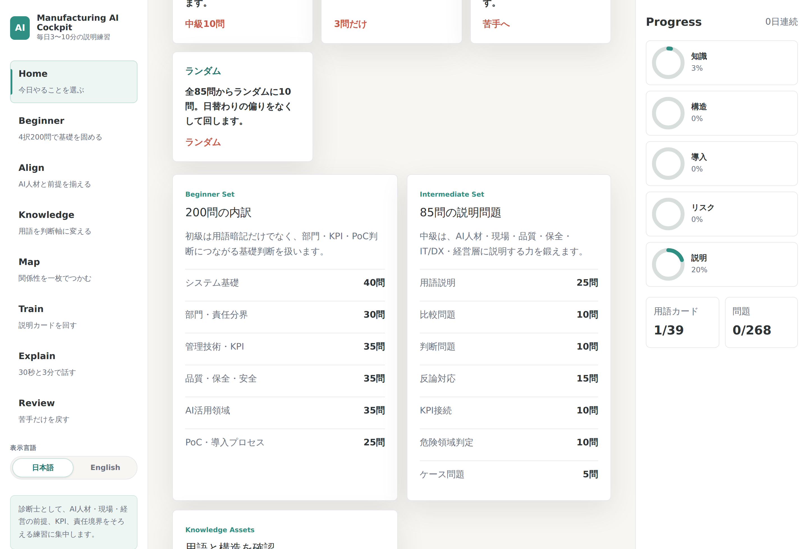 | 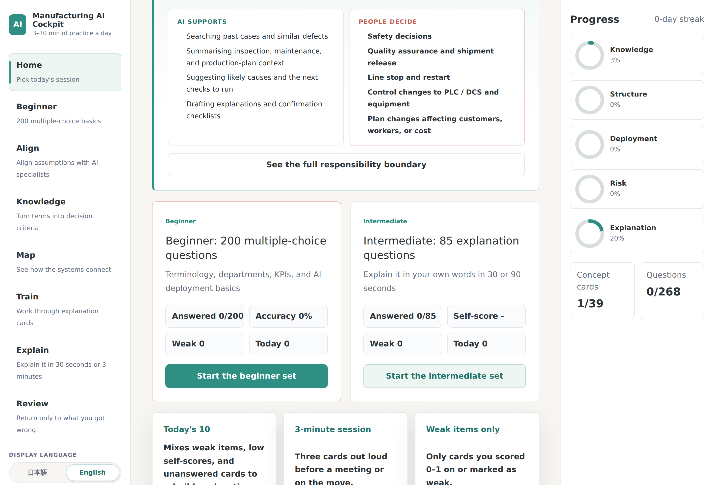 |
| Alignment Studio | 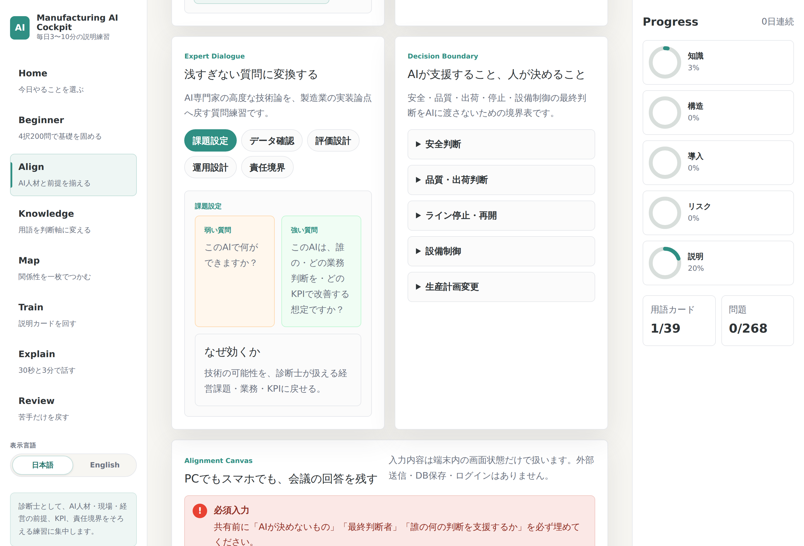 | 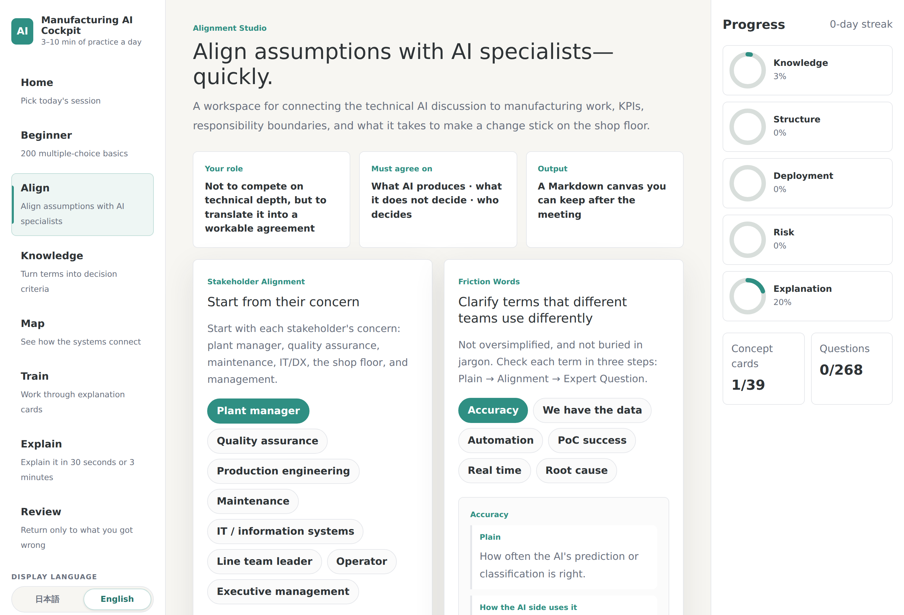 |
| Map Room | 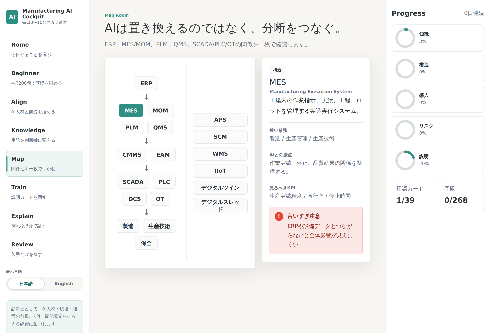 | 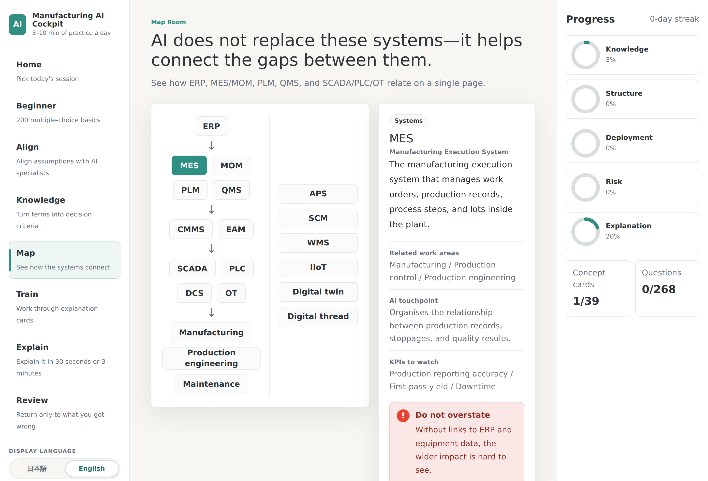 |
| Answer confirmation | 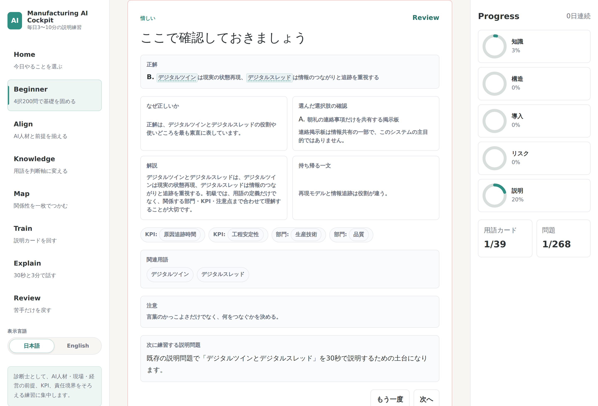 | 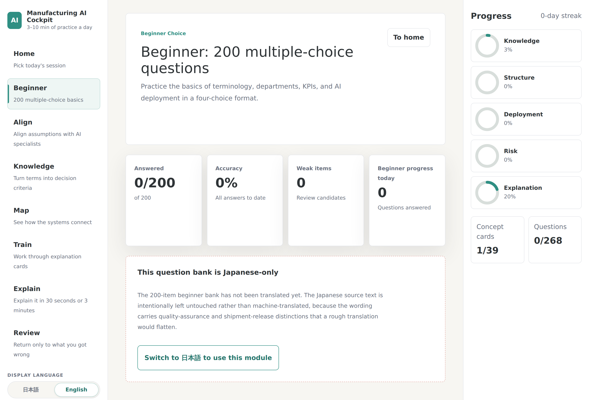 |
| Review Vault | 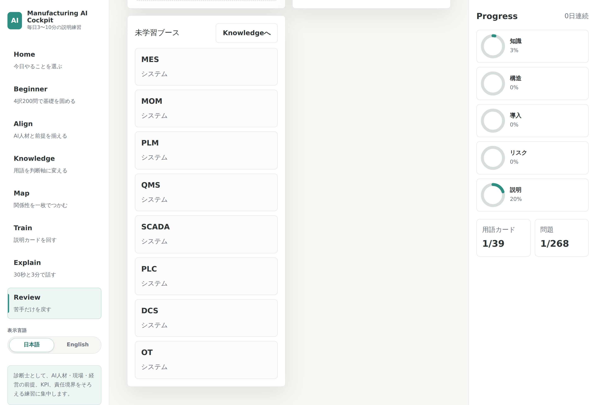 | 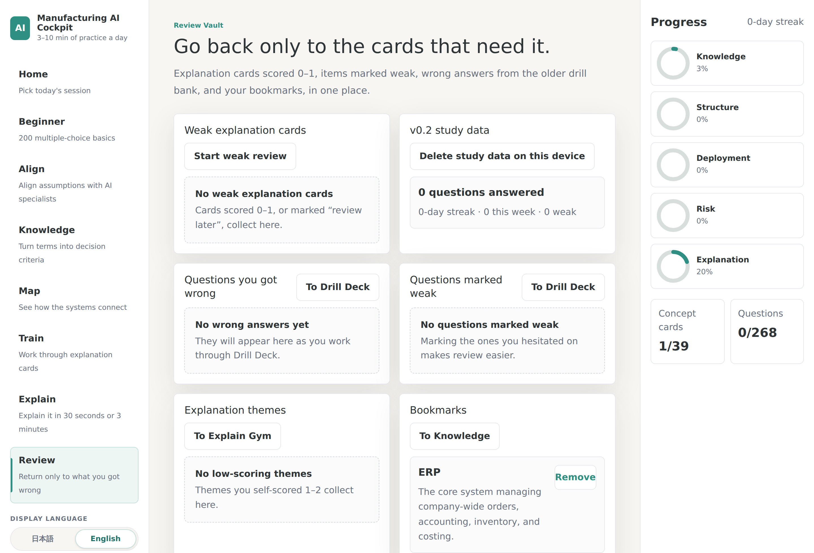 |
| Cockpit (mobile) | 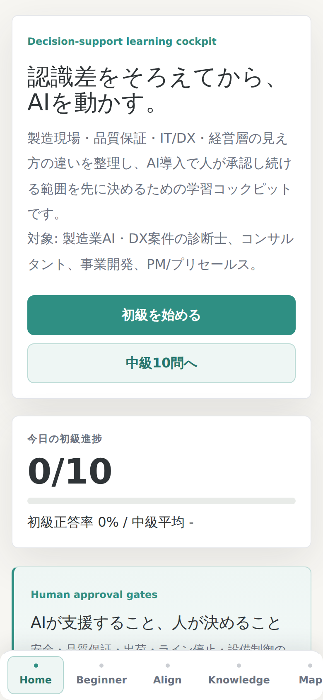 | 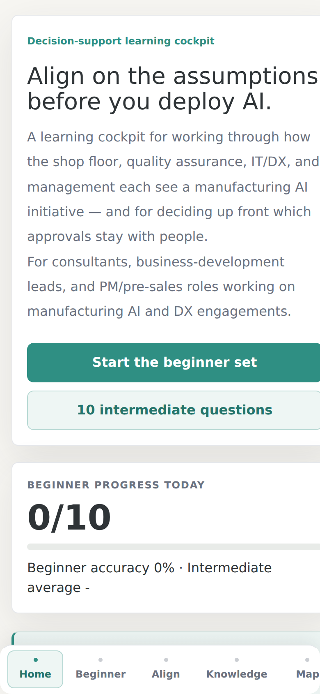 |
| Language switcher | 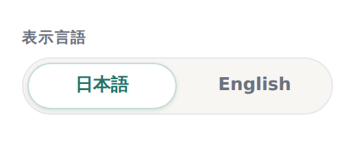 | 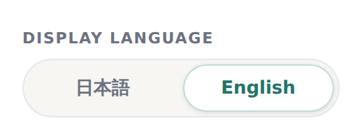 |

The English answer-confirmation image shows the Japanese-only notice, because that is
what an English reader actually sees on that module today.

## Setup

```bash
npm ci
npm run dev
```

Open the local URL Vite prints. Append `?lang=en` for the English locale.

## Quality checks

```bash
npm run verify      # lint + typecheck + test + build
```

Or individually:

```bash
npm run lint
npm run typecheck
npm run audit:questions   # 85 intermediate explanation questions
npm run audit:beginner    # 200 beginner questions, category and answer balance
npm run audit:glossary    # glossary references resolve
npm run audit:i18n        # dictionary parity and content coverage
npm run audit:links       # every relative Markdown link resolves
npm run test:locale       # locale resolution, FUGU errors, wording guardrails
npm run test:browser      # Playwright: both locales in a real browser
npm run build
```

`npm test` runs the six data/i18n checks. `npm run test:browser` is separate because it
needs a browser binary:

```bash
npx playwright install --with-deps chromium
npm run test:browser
```

It starts and stops Vite itself, so it is a single self-contained command. Both
`npm run verify` and `npm run test:browser` run on every pull request via
[`.github/workflows/verify.yml`](.github/workflows/verify.yml).

`audit:i18n` fails on a missing key, an empty value, a type divergence, or a value still
containing Japanese — verified against injected regressions. `audit:links` fails when a
Markdown link points at a file that is not in the repository; it was added after exactly
that defect shipped on this branch, when an unanchored `audit/` rule in `.gitignore`
silently excluded `docs/audit/` from a commit.

## Limitations

- A learning and portfolio application, not a production MES / QMS / SCADA integration.
- No connection to real factory systems, customer data, or production equipment.
- Progress is stored only in the current browser via `localStorage`.
- The English locale is **incomplete**: the 200-item and 85-item question banks and the
  82-term glossary are Japanese-only. Those modules say so in English rather than showing
  untranslated content.
- The FUGU review helper is development-only and is not part of the public demo. Its
  user-facing error messages are localized; the review prompt sent to the model is not.
- The production bundle is a single ~1 MB JS chunk; it is not code-split.

## Deployment status

Honest state of the source-to-deploy relationship, as of 2026-07-25:

- The Netlify host could not be reached from the environment this branch was built in
  (blocked by an outbound network policy), so the live page was **not** compared against
  this source. That check is open.
- Vite emits content-hashed asset names, so a one-step verification exists: if
  `view-source:` on the live site references the same `assets/index-*.js` and
  `assets/index-*.css` filenames a local `npm run build` produces, the deployment matches
  that commit.
- Earlier README revisions described the canonical source as living outside Git. Within
  this repository that is no longer accurate to assert either way: the repository builds
  and passes every quality gate on a clean `npm ci`, and no out-of-Git copy was reachable
  to compare against. If a newer local working copy exists, it has not been merged here.

Full detail, including every command run and its result:
[`docs/audit/source-and-live-parity-20260725.md`](docs/audit/source-and-live-parity-20260725.md).

## Data policy

All app content is **synthetic demo and learning data**. It is not copied from any client
project and does not represent a real factory, real customer, or confidential engagement.

- Nothing you type is sent anywhere. The Alignment Canvas keeps its draft in
  `localStorage` and exports Markdown locally; there is no backend, database, or login.
- Progress lives only in the current browser and can be deleted from Review Vault.
- The optional FUGU review sends only the question metadata and the answer text needed
  for review, and only when explicitly enabled in development. Free-form private notes
  are never sent.

Main data files:

- `src/data/concepts.ts` — 39 manufacturing systems, departments, KPIs, AI touchpoints
- `src/data/beginnerChoiceQuestions.ts` — 200 beginner multiple-choice questions
- `src/data/trainingQuestions.ts` — 85 intermediate explanation questions
- `src/data/explainDrills.ts` — 30-second / 3-minute explanation drills
- `src/data/scenarios.ts` — stakeholder concerns and better/worse responses
- `src/data/glossary.ts` — 82 inline glossary definitions
- `src/data/glossaryFrictions.ts` — words whose meaning drifts between AI and manufacturing
- `src/data/decisionAuthority.ts` — what AI may support vs. what humans must decide
- `src/data/expertDialogues.ts` — better questions to ask AI and technical experts
- `src/i18n/content/` — English overlays for the above, keyed by the same IDs

## Optional local FUGU review server

An optional development helper, not required for the public static demo.

`.env.local` example:

```bash
VITE_FUGU_ENABLED=true
VITE_FUGU_REVIEW_ENDPOINT=/api/fugu-review
FUGU_API_KEY=replace-with-local-secret
FUGU_API_BASE=https://example.invalid/v1/chat/completions
FUGU_MODEL=replace-with-model-name
```

Run in separate terminals:

```bash
npm run fugu:server
npm run dev
```

- Keep `VITE_FUGU_ENABLED=false` for public builds.
- Do not commit `.env.local` or real API keys.
- If the server is not configured or times out, the training flow continues without it.

## License

MIT. See [`LICENSE`](LICENSE).
